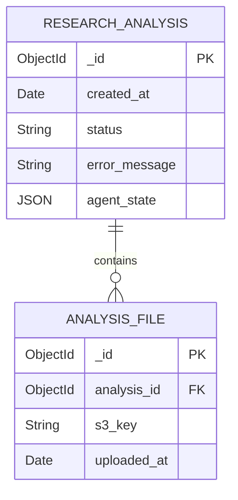

# Research Analysis Backend – MongoDB Data Model (v2)

## 1. Collections & Fields

### **research_analysis**

| Field             | Type       | Description                                                                          |
| ----------------- | ---------- | ------------------------------------------------------------------------------------ |
| **_id**           | `ObjectId` | Primary key returned immediately after `POST /api/v1/research-analysis`.             |
| **created_at**    | `Date`     | Session creation timestamp.                                                          |
| **status**        | `String`   | Coarse life‑cycle state (`INIT`, `FILES_UPLOADED`, `RUNNING`, `COMPLETED`, `ERROR`). |
| **error_message** | `String`   | Present when `status = ERROR`.                                                       |
| **agent_state**   | `Object`   | In‑memory LangGraph state blob (see next table).                                     |
|                   |            |                                                                                      |

#### `agent_state` sub-document (LangGraph state)

| Field                       | Type            | Notes                                                       |
| --------------------------- | --------------- | ----------------------------------------------------------- |
| **process_start_date**      | `Date`          | Set when `/start` is invoked.                               |
| **transcripts**             | `Array<String>` | **Full raw transcript text** (markdown).                    |
| **transcripts_pii_cleaned** | `Array<String>` | **PII‑scrubbed transcript text**.                           |
| **affinity_map**            | `String`        | Markdown content of the generated affinity map.             |
| **findings_report**         | `String`        | Markdown content of the generated research findings report. |
| **status**                  | `String`        | Fine‑grained LangGraph status.                              |
| **error_message**           | `String`        | Latest LangGraph error, if any.                             |

---

### **analysis_file**

| Field           | Type       | Description                                                                    |
| --------------- | ---------- | ------------------------------------------------------------------------------ |
| **_id**         | `ObjectId` | Primary key.                                                                   |
| **analysis_id** | `ObjectId` | Foreign key → `research_analysis._id`.                                         |
| **s3_key**      | `String`   | S3 URI or key where the file is stored.                                        |
| **uploaded_at** | `Date`     | Timestamp recorded when file is registered.                                    |

> **Indexes**  
> • `research_analysis.status` – quick dashboard / queue queries  
> • `analysis_file.analysis_id` – one‑to‑many lookup  

---

## 2. Mermaid ER Diagram

---

## 3. Assumptions

1. Only **text‑based markdown** artifacts are handled (no binary media).  
2. MongoDB keeps **S3 keys** in `analysis_file`, but the LangGraph runtime loads file bodies and writes them into `agent_state`.  
3. No multi‑tenant segregation, versioning, or TTL rules for now.  
4. Single string `status` is sufficient for API + LangGraph.  
5. Each run is a new `research_analysis` document – no re‑runs / versioning.

---
