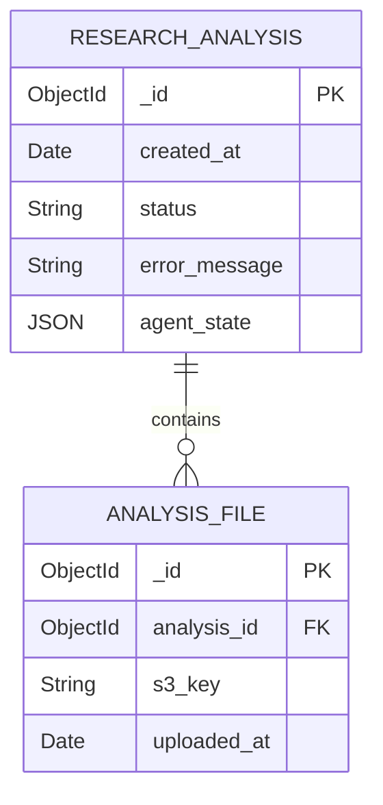

# CONTEXT

We're developing a backend API that processes user research transcripts and then runs an agentic workflow to analyze the transcripts and produce and affinity map and research findings report.

# ANALYSIS PHASE:

Read each of the following documents, analyse them.

DATA MODEL:

# Research Analysis Backend – MongoDB Data Model (v2)

## 1. Collections & Fields

### **research_analysis**

| Field             | Type       | Description                                                                          |
| ----------------- | ---------- | ------------------------------------------------------------------------------------ |
| **_id**           | `ObjectId` | Primary key returned immediately after `POST /api/v1/research-analysis`.             |
| **created_at**    | `Date`     | Session creation timestamp.                                                          |
| **status**        | `String`   | Coarse life‑cycle state (`INIT`, `FILES_UPLOADED`, `RUNNING`, `COMPLETED`, `ERROR`). |
| **error_message** | `String`   | Present when `status = ERROR`.                                                       |
| **agent_state**   | `Object`   | In‑memory LangGraph state blob (see next table).                                     |
|                   |            |                                                                                      |

#### `agent_state` sub-document (LangGraph state)

| Field                       | Type            | Notes                                                       |
| --------------------------- | --------------- | ----------------------------------------------------------- |
| **process_start_date**      | `Date`          | Set when `/start` is invoked.                               |
| **transcripts**             | `Array<String>` | **Full raw transcript text** (markdown).                    |
| **transcripts_pii_cleaned** | `Array<String>` | **PII‑scrubbed transcript text**.                           |
| **affinity_map**            | `String`        | Markdown content of the generated affinity map.             |
| **findings_report**         | `String`        | Markdown content of the generated research findings report. |
| **status**                  | `String`        | Fine‑grained LangGraph status.                              |
| **error_message**           | `String`        | Latest LangGraph error, if any.                             |

---

### **analysis_file**

| Field           | Type       | Description                                                                    |
| --------------- | ---------- | ------------------------------------------------------------------------------ |
| **_id**         | `ObjectId` | Primary key.                                                                   |
| **analysis_id** | `ObjectId` | Foreign key → `research_analysis._id`.                                         |
| **s3_key**      | `String`   | S3 URI or key where the file is stored.                                        |
| **uploaded_at** | `Date`     | Timestamp recorded when file is registered.                                    |

> **Indexes**  
> • `research_analysis.status` – quick dashboard / queue queries  
> • `analysis_file.analysis_id` – one‑to‑many lookup  

---

## 2. Mermaid ER Diagram



---

## 3. Assumptions

1. Only **text‑based markdown** artifacts are handled (no binary media).  
2. MongoDB keeps **S3 keys** in `analysis_file`, but the LangGraph runtime loads file bodies and writes them into `agent_state`.  
3. No multi‑tenant segregation, versioning, or TTL rules for now.  
4. Single string `status` is sufficient for API + LangGraph.  
5. Each run is a new `research_analysis` document – no re‑runs / versioning.

---


API ENDPOINTS:
## API Endpoints

All endpoints are versioned (`/api/v1/**`) and use **plural** resource names.  
Unless stated otherwise, the payload format is `application/json` and IDs are MongoDB `ObjectId` values (24-character hex strings).

---

### 1. Research-Analysis Sessions

| Verb       | Endpoint                         | Purpose                                       |
| ---------- | -------------------------------- | --------------------------------------------- |
| **POST**   | `/api/v1/research-analyses`      | Create a new session                          |
| **GET**    | `/api/v1/research-analyses`      | List all sessions                             |
| **GET**    | `/api/v1/research-analyses/{id}` | Retrieve one session (includes `agent_state`) |
| **DELETE** | `/api/v1/research-analyses/{id}` | Hard-delete a session (admin-only)            |
|            |                                  |                                               |

#### 1.1 Create session

`POST /api/v1/research-analyses`

```http
Request Body   # empty for now; kept extensible
{}
```

```jsonc
Response 201
{
  "_id": "661c0a7b8f45cc46d0f9f2c1",
  "created_at": "2025-06-04T14:05:21.381Z",
  "status": "INIT",
  "error_message": null,
  "agent_state": null
}
```

#### 1.2 List sessions

`GET /api/v1/research-analyses`

```jsonc
[
  {
    "_id": "661c0a7b8f45cc46d0f9f2c1",
    "created_at": "2025-06-04T14:05:21.381Z",
    "status": "COMPLETED"
  },
  {
    "_id": "661c0a96b54eea8535d9b34a",
    "created_at": "2025-06-04T15:17:02.119Z",
    "status": "RUNNING"
  }
]
```

#### 1.3 Get single session

`GET /api/v1/research-analyses/{id}`

```jsonc
{
  "_id": "661c0a7b8f45cc46d0f9f2c1",
  "created_at": "2025-06-04T14:05:21.381Z",
  "status": "COMPLETED",
  "error_message": null,
  "agent_state": {
    "process_start_date": "2025-06-04T14:06:04.002Z",
    "transcripts": [
      "## Interview #1\n\nRaw markdown transcript…"
    ],
    "transcripts_pii_cleaned": [
      "## Interview #1\n\n(PII removed)…"
    ],
    "affinity_map": "Markdown affinity map content…",
    "findings_report": "# Key Findings\n\n* …",
    "status": "FINISHED",
    "error_message": null
  }
}
```

---

### 2. Transcript Uploads

|Verb|Endpoint|Purpose|
|---|---|---|
|**POST**|`/api/v1/research-analyses/{id}/transcripts`|Upload one or more transcript files|
|**GET**|`/api/v1/research-analyses/{id}/transcripts`|List registered transcripts|

#### 2.1 Upload transcripts

`POST /api/v1/research-analyses/{id}/transcripts`  
_Consumes_ `multipart/form-data` — each part must be a `.md` or `.txt` file (no `.docx`).

```bash
curl -X POST \
  -F "files=@interview1.md" \
  -F "files=@interview2.txt" \
  /api/v1/research-analyses/661c0a7b8f45cc46d0f9f2c1/transcripts
```

```jsonc
Response 201
[
  {
    "_id":        "661c0b32a18dff4b3c9bd5e0",
    "analysis_id": "661c0a7b8f45cc46d0f9f2c1",
    "s3_key":     "research/661c0a7b…/interview1.md",
    "uploaded_at": "2025-06-04T14:07:54.009Z"
  },
  {
    "_id":        "661c0b32a18dff4b3c9bd5e1",
    "analysis_id": "661c0a7b8f45cc46d0f9f2c1",
    "s3_key":     "research/661c0a7b…/interview2.txt",
    "uploaded_at": "2025-06-04T14:07:54.087Z"
  }
]
```

---

### 3. Workflow Control

|Verb|Endpoint|Purpose|
|---|---|---|
|**POST**|`/api/v1/research-analyses/{id}/start`|Begin the async agentic workflow|

`POST /api/v1/research-analyses/{id}/start`

```http
Request Body   # empty; the path ID is sufficient
{}
```

```jsonc
Response 202
{
  "message": "Analysis run queued.",
  "analysis_id": "661c0a7b8f45cc46d0f9f2c1",
  "status": "RUNNING"
}
```

---

### 4. Error Object (shared shape)

```jsonc
{
  "status": "ERROR",
  "error_message": "Human-readable explanation",
  "code": "TRANSCRIPT_FORMAT_INVALID"   // optional machine code
}
```

---

`## Example Sequence (Happy Path)

1. **Create session** → `POST /research-analyses`  
    → returns `_id = 661c0a7b…`, `status = INIT`
    
2. **Upload transcripts** → `POST /research-analyses/{id}/transcripts`  
    → server records files, may update `status` internally
    
3. **Kick off workflow** → `POST /research-analyses/{id}/start`  
    → returns `status = RUNNING`
    
4. **Poll session** → `GET /research-analyses/{id}` until processing finishes (`status = COMPLETED` or `ERROR`).

Confirm you have read the content of the documents, then continue...

# IMPLEMENTATION PHASE:

Create a detailed product requirements document that breaks down the functionality by feature.  The end result should be a list of features, with backend user stories detailed for the given feature.  The stories should be discrete and detailed.  There may be multiple stories per feature.  The end result should be a hybrid of very good user stories, with the details found in a PRD.  Please number the features and the stories so they can be easily referred to later.

Each story format should be in the following format:
- Story title
- Story written in As a, I want, so that story format
- Testable acceptance criteria in Given, When, Then BDD format
- Detailed Architecture Design Notes
- Include any other detail or relevant notes that would help an AI-powered coding tool understand and correctly implement the features.
- Include any information about stories that are dependencies.
- Include any information about related stories for context.

You should also give any overarching context in the feature description.

At the top of the document include the detail of the data model for reference.

Do NOT include any summary, timelines, or non-functional requirements, unless they are relevant to the specific feature implementations.
Do NOT add any functionality that isn't in the above requirements, only add the functionality already defined.
Do NOT include any frontend stories in these requirements.

Include a short 'Context' part at the top of the document that details the purpose and background information that is relevant to the project overall.

# VERIFICATION AND COMPLETION PHASE:
Validate your work to check that all the features defined in the documents above meet all the necessary requirements and there is no ambiguity or overlap before writing the final output.
